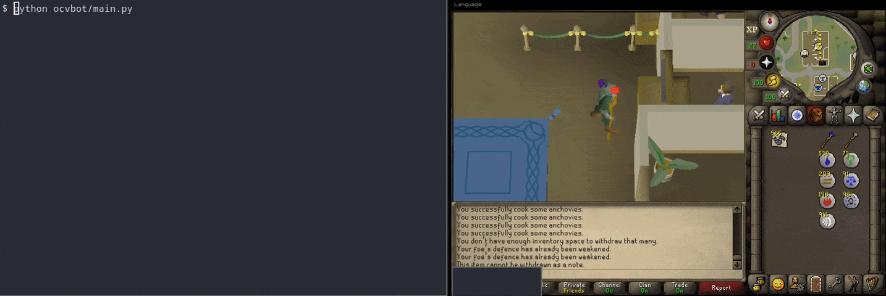

# OCVbot

The OSRS Computer Vision bot

- This bot is an image bot, meaning it interacts with the game client the same
  way a human does: by looking for specific images or patterns and responding
  accordingly. No client injection, reflection, or modifications of any kind are
  used. This makes the program undetectable using traditional methods.
- All interactions with the game client are randomized to the greatest extent
  possible. This includes randomized mouse movements, click coordinates, wait
  durations, and session durations.
- If you have a question about how the program works, please open an issue.



## INSTALLATION

1. Clone this repository into your home directory.
```bash
cd ~
git clone --depth 1 https://github.com/takelley1/OCVBot.git
```

2. Create and enter a Python virtual environment.
```bash
cd OCVBot
python3 -m venv ocvbot_venv
source ocvbot_venv/bin/activate
```

3. Install OCVBot's Python dependencies into your virtual environment.
```bash
pip3 install -r requirements.txt
```

4. Create a file in the `credentials` directory called `username.txt` and add
   your account's username to it.
```bash
echo "ThisIsMyUsername" > credentials/username.txt
```

5. Create another file in the `credentials` directory called `password.txt` and
   and your account's password to it. Accounts with 2-factor authentication are
   not supported.
```bash
echo "ThisIsMySuperSecretPassword" > credentials/password.txt
```

6. Copy `ocvbot/config.yaml.example` to `ocvbot/config.yaml`.
```bash
cp "ocvbot/config.yaml.example" "ocvbot/config.yaml"
```

7. Read and edit `ocvbot/config.yaml` with your desired configuration settings.

8. Check `docs/scenarios` for the proper client configuration
   settings and information about each script. Configurations in the `common/` directory are shared by all
   scripts. Configurations in all other directories are unique to that script
   only.

9. Launch the OldSchool Runescape client. A wrapper script is provided in
   this repository.
```bash
./tools/osrs.sh
```

10. Adjust your client to match the screenshots in `docs/scenarios`.
    Make sure your character is in the correct starting position before running
    the bot. Third-party clients like Runelite have not been tested.

11. Start the bot.
```
python3 ./ocvbot/main.py
```

- To stop the bot, use CTRL-C on the terminal window running the bot.
- To exit the virtual environment, run `deactivate`.
> NOTE: You must activate the virtual environment every time you wish to run the bot!

## CONFIGURATION

- Currently OCVBot is configured via a few basic settings in the
  `ocvbot/config.yaml` file. Please see the comments in that file for information
  on how to configure each parameter.
- The bot takes random short breaks, so don't be alarmed if it appears to do
  nothing for a short while. The program's log output will indicate when this occurs.
- For more technical users, comprehensive API documentation is available in
  function docstrings.

---

*This bot was written for educational purposes only. I am not responsible for how
you use this software.*
